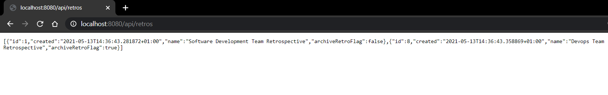
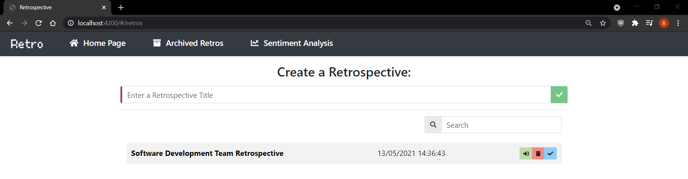

# Retro: A Retrospective Application


This project aims facilitate sprint retrospectives remotely. It was made using the Angular framework with a Spring RESTful API, as well as Bootstrap.
<br>
It is a CRUD application that utilises the Angular framework to make HTTP requests to a Spring RESTful API, storing data in a H2 in-memory relational database.

## Development server

Run `SPRING_PROFILES_ACTIVE= mvn spring-boot:run` in the API directory for a server. Navigate to `http://localhost:8080/api/` 
<br> 
Changes any of the source files will display upon reload.

When running using the local profile, the example retrospective's details are shown.


Similarly, navigate to `http://localhost:8080/api/retros/1` to only display that retrospective's details.
<br>

Navigating to `http://localhost:8080/api/retros/1/items` and `http://localhost:8080/api/retros/1/action-items` will show the items and action items associated with the retrospective.

<br>

Run `ng serve` in the UI directory for a dev server. Navigate to `http://localhost:4200/` 
<br>
The app will automatically reload if you change any of the source files.
When running the local profile, the example retrospectives are seen on the UI.

## Using the application
Upon running the above commands and navigating to `http://localhost:4200/`, the example retrospectives are shown.



From here, create a new retrospective by entering a name and clicking the check-mark button. Retrospectives that have been archived can also be 
viewed by clicking the archived Retrospectives button on the navbar.
<br>

After creating a retrospective, enter a retrospective by clicking the arrow facing right and delete a retrospective by clicking the trash button.
If there are a number of existing retrospectives, search for one by name by using the input field beside the magnifying glass icon.

<br>

Upon entering a retrospective, three columns are present at the top of the page for the retrospectives items:
- Things that went well - denotes where things that went well in the sprint should be entered.
- Questions - denotes where the team should ask any questions they have.
- Things that did not go so well - denotes where things that didn't so well in the sprint should be entered.


<br>

Item buttons do the following: 
- Upward arrow: up-votes the item.
- Downward arrow: down-votes the item.
- (Items are sorted in ascending order by most up-voted)
- Trash: deletes the item.
- Check: marks the item as 'done', meaning it has been discussed in the retrospective and moves it to the bottom of the list.
- Pencil: opens the item editor, allowing the modification of the item's description.

<br>

At the bottom of the page, the retrospective's action items are shown.


Action item buttons do the following:
- Pencil: opens the item editor, allowing the modification of the item's description.
- Trash: deletes the item.

Retro also performs a Sentiment Analysis on a retrospective by using the words present in the items. By clicking 
the Sentiment Analysis button present on the navbar, a retrospective can be selected to perform a Sentiment Analysis
on.

<br>
Retro will then provide a score out of one hundred for the sentiment present in a retrospective, 
and a recommendation depending whether the sentiment is positive or negative.


## Structure

The project is separated into an API directory and, a UI directory.
 
The Angular UI project structure is separated into its components (each containing the projects HTML, CSS and Typescript), models, services and assets.

``` BASH
.
├── app
│   ├── app-routing.module.ts
│   ├── app.component.css
│   ├── app.component.html
│   ├── app.component.spec.ts
│   ├── app.component.ts
│   ├── app.module.ts
│   ├── components
│   │   ├── action-item-form
│   │   │   ├── action-item-form.component.css
│   │   │   ├── action-item-form.component.html
│   │   │   ├── action-item-form.component.spec.ts
│   │   │   └── action-item-form.component.ts
│   │   ├── archived-retros
│   │   │   ├── archived-retros.component.css
│   │   │   ├── archived-retros.component.html
│   │   │   ├── archived-retros.component.spec.ts
│   │   │   └── archived-retros.component.ts
│   │   ├── item-form
│   │   │   ├── item-form.component.css
│   │   │   ├── item-form.component.html
│   │   │   ├── item-form.component.spec.ts
│   │   │   └── item-form.component.ts
│   │   ├── retros
│   │   │   ├── retro-item-votes.pipe.spec.ts
│   │   │   ├── retro-item-votes.pipe.ts
│   │   │   ├── retro-item.pipe.spec.ts
│   │   │   ├── retro-item.pipe.ts
│   │   │   ├── retros.component.css
│   │   │   ├── retros.component.html
│   │   │   ├── retros.component.spec.ts
│   │   │   └── retros.component.ts
│   │   ├── retros-list
│   │   │   ├── retro-archived.pipe.spec.ts
│   │   │   ├── retro-archived.pipe.ts
│   │   │   ├── retro.pipe.spec.ts
│   │   │   ├── retro.pipe.ts
│   │   │   ├── retros-list.component.css
│   │   │   ├── retros-list.component.html
│   │   │   ├── retros-list.component.spec.ts
│   │   │   └── retros-list.component.ts
│   │   ├── sentiment-analysis
│   │   │   ├── sentiment-analysis.component.css
│   │   │   ├── sentiment-analysis.component.html
│   │   │   ├── sentiment-analysis.component.spec.ts
│   │   │   └── sentiment-analysis.component.ts
│   │   └── sentiment-analysis-list
│   │       ├── sentiment-analysis-list.component.css
│   │       ├── sentiment-analysis-list.component.html
│   │       ├── sentiment-analysis-list.component.spec.ts
│   │       ├── sentiment-analysis-list.component.ts
│   │       ├── sentiment-analysis-list.pipe.spec.ts
│   │       └── sentiment-analysis-list.pipe.ts
│   ├── models
│   │   ├── actionItem.ts
│   │   ├── item.ts
│   │   ├── retro.ts
│   │   └── sentimentAnalysis.ts
│   └── services
│       ├── retro.service.spec.ts
│       └── retro.service.ts
├── assets
│   ├── logo.png
│   └── retro-favicon.png
├── environments
│   ├── environment.prod.ts
│   └── environment.ts
├── index.html
├── main.ts
├── polyfills.ts
├── proxy.conf.json
├── styles.css
└── test.ts
```

The API project is separated into configurations, controllers, exceptions, models, repositories, and services.

``` BASH
.
├── pom.xml
└── src
    ├── main
    │   ├── java
    │   │   └── com
    │   │       └── retrospective
    │   │           ├── RestServiceApplication.java
    │   │           ├── configs
    │   │           │   └── LoadDatabase.java
    │   │           ├── controllers
    │   │           │   └── RetrosController.java
    │   │           ├── exceptions
    │   │           │   ├── ActionItemNotFoundException.java
    │   │           │   ├── ItemNotFoundException.java
    │   │           │   ├── RetrosNotFoundException.java
    │   │           │   └── SentimentAnalysisNotFoundException.java
    │   │           ├── models
    │   │           │   ├── ActionItem.java
    │   │           │   ├── BaseEntity.java
    │   │           │   ├── Item.java
    │   │           │   ├── ItemType.java
    │   │           │   ├── Retro.java
    │   │           │   └── SentimentAnalysis.java
    │   │           ├── repositories
    │   │           │   ├── ActionItemsRepository.java
    │   │           │   ├── ItemsRepository.java
    │   │           │   ├── RetrosRepository.java
    │   │           │   └── SentimentAnalysisRepository.java
    │   │           └── services
    │   │               └── RetrosService.java
    │   └── resources
    │       ├── Dictionaries
    │       │   ├── AFINN-en-165.txt
    │       │   └── stopWords.txt
    │       └── application.yml
    └── test
        └── java
            └── com
                └── retrospective
                    ├── RestServiceApplicationTests.java
                    ├── controllers
                    │   └── RetrosControllerTest.java
                    └── services
                        └── RetrosServiceTest.java


```
